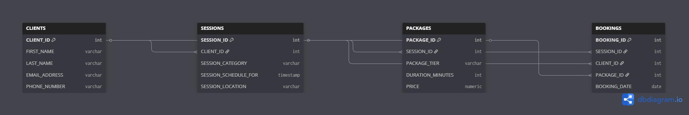

# photography-business-sql-project
End-to-end SQL project starting with table creation, data cleaning and using PostgreSQL to analyze the photography business dataset
# 📸 Photography Business SQL Project

## 📖 Project Overview

This project demonstrates an end-to-end SQL data analytics workflow by designing, building, cleaning, validating, and analyzing a relational database for a fictional photography business.

The raw datasets were intentionally created with inconsistent formatting, missing values, misspelled text, duplicate records, and invalid values to simulate real-world data quality issues. SQL was then used to clean, standardize, validate, and analyze the data.

This project showcases practical SQL skills used by data analysts and database professionals.

---

# 🎯 Objectives

- Design a relational database
- Create normalized database tables
- Import raw datasets into PostgreSQL
- Clean messy real-world style data
- Validate data quality
- Create cleaned production-ready tables
- Perform SQL analysis
- Document the entire workflow

---

# 🛠 Technologies Used

- PostgreSQL
- pgAdmin 4
- SQL
- Git
- GitHub
- dbdiagram.io

---

# 🗂 Project Structure

```
photography-business-sql-project/

│
├── README.md
│
├── SQL/
│   ├── 01_create_tables.sql
│   ├── 02_load_data.sql
│   ├── 03_data_cleaning.sql
│   ├── 04_create_clean_tables.sql
│   ├── 05_data_validation.sql
│   └── 06_analysis_queries.sql
│
├── Data/
│   ├── clients_raw_data.csv
│   ├── sessions_raw_data.csv
│   ├── package_raw_data.csv
│   └── bookings_raw_data.csv
│
├── Cleaned_Data/
│   ├── clean_clients.csv
│   ├── clean_sessions.csv
│   ├── clean_packages.csv
│   └── clean_bookings.csv
│
└── Images/
    ├── ERD.png
    ├── raw_data_preview.png
    ├── clean_data_preview.png
    ├── validation_results.png
    └── analysis_results.png
```

---

# 📊 Database Design

The database was designed using an Entity Relationship Diagram (ERD) before implementation.

The project contains four related tables:

- CLIENTS
- SESSIONS
- PACKAGES
- BOOKINGS

Relationships were established using primary and foreign keys to ensure data integrity.

*(Insert your ERD image here)*

```markdown

```

---

# 🔄 Project Workflow

This project followed a complete data analytics workflow:

1. Designed the database schema
2. Created raw database tables
3. Loaded raw CSV datasets into PostgreSQL
4. Cleaned and standardized raw data
5. Created cleaned production tables
6. Validated the cleaned data
7. Performed business analysis using SQL

*(Insert your workflow image here)*

```markdown

```

---

# 🧹 Data Cleaning Process

The raw datasets contained numerous data quality issues, including:

- Leading and trailing spaces
- Inconsistent capitalization
- Misspelled package tiers
- Missing values
- Invalid duration values
- Incorrect price formatting
- Duplicate records
- Inconsistent phone numbers
- Mixed text and numeric values

Cleaning techniques included:

- TRIM()
- LOWER()
- INITCAP()
- COALESCE()
- NULLIF()
- CASE expressions
- REGEXP_REPLACE()
- CAST()
- TO_CHAR()

Business rules were applied to standardize package tiers, durations, and pricing.

Example corrections:

| Before | After |
|---------|-------|
| Basci | Basic |
| Standrd | Standard |
| Premum | Premium |
| Delux | Deluxe |
| Luxry | Luxury |
| one fifty | $150.00 |
| sixty | 60 |

*(Insert screenshots of the raw and cleaned data here)*

```markdown


```

---

# ✅ Data Validation

After cleaning, validation queries were used to verify data quality.

Validation included:

- Record count comparisons
- Missing value detection
- Duplicate detection
- Foreign key validation
- Package tier validation
- Price validation
- Duration validation
- Email formatting
- Phone number formatting


```markdown

```

---

# 📈 SQL Analysis

Once the data was cleaned, SQL queries were used to analyze the business data.

Example analyses included:

- Package popularity
- Session type distribution
- Customer counts
- Revenue by package tier
- Booking trends
- Session trends

*(Insert analysis screenshot here)*

```markdown

```

---

# 📁 SQL Files

| File | Description |
|------|-------------|
| 01_create_tables.sql | Creates all raw database tables |
| 02_load_data.sql | Documents loading the raw CSV datasets |
| 03_data_cleaning.sql | Cleans and standardizes raw data |
| 04_create_clean_tables.sql | Creates cleaned tables |
| 05_data_validation.sql | Verifies data quality |
| 06_analysis_queries.sql | Business analysis using SQL |

---

# 📌 Key SQL Skills Demonstrated

- Database Design
- Relational Databases
- PostgreSQL
- Data Cleaning
- Data Validation
- Data Transformation
- Data Normalization
- CASE Statements
- Joins
- Aggregate Functions
- Common Table Expressions (CTEs)
- Regular Expressions
- String Functions
- Window Functions (if applicable)
- Business Analysis

---

# 📚 What I Learned

Through this project I strengthened my ability to:

- Design relational databases
- Build normalized SQL tables
- Create realistic datasets
- Clean messy data
- Apply business rules
- Validate data quality
- Analyze business information using SQL
- Document an end-to-end analytics project
- Organize a professional GitHub portfolio

---

# 🚀 Future Improvements

Possible enhancements include:

- Build an interactive Power BI dashboard
- Develop Tableau visualizations
- Automate the data cleaning pipeline
- Add stored procedures
- Create SQL views
- Optimize query performance with indexes
- Expand the dataset with additional business scenarios

---

# 👤 Author

**Nash Rust**

Aspiring Data Analyst

Skills:
- SQL
- PostgreSQL
- Excel
- GitHub
- Data Cleaning
- Data Validation
- Relational Database Design
